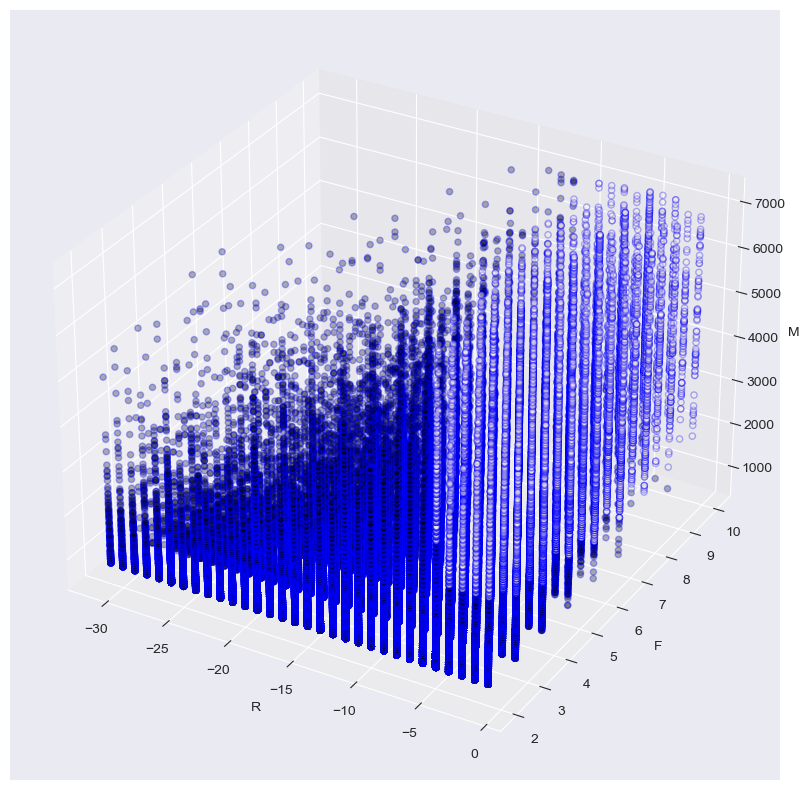

# Customer-Behavior-Analysis
this project is going to develop a customer behavior analysis model based on RFM model, Clustering and Logistic Regression algorithm <br>
____
# Executive Summary
Under the age of digital transformation and COVID, people are willing to surf internet to purchase items for their interests and daily life. To stand from the knee competition in e-Commerce market, especially retail industry, companies desire a tool to study and visualize their customer behavior in order to develop a high-degree of customization marketing campiagn or product to customer.<br>
Data is the best tool to represent, measure, and record the customer activities which happended in the store.OpenData Bank (The Bank) is the 2021 opendata project which is launched by HKTV. The Bank provides a busienss data of HKTV mall to public which includes Transaction and Traffic Data. It is a greate opportunity to public to study the customer in Hong Kong. Most of the companies would like to identify the most profitable customers and invest resources with them for customer relationship management. Therefore, "Who are our valuable customers?" is the common busienss problem in the question list of company. <br>
This project is going to develop a RFM model to define the meaning of "profitable" with clustering algoritm and :<br>
1. detect the most profitable customers using RFM model
2. study profitable customers consumption behavior after detection through regression model with features selection
## Findings Conclusion
From this data project, we found the valuable customers have the following behavior preferences:
1. pretend to create or through mobile application instead of web version of HKTV mall
2. personal care & health, housewares, fruits, vegetables & flowers, and mother & baby are the top hit product categories
3. pretend to make order on wedesday and satuarday
4. unfavor to weighted packages
5. concetrate to purchase a specific primary categories

## Data Source
The source of data is from [OpenData Bank](https://opendatabank.hktvmall.com/portal/home) which is containing 2021Q1 transaction data. those daily raw data are stored as csv file with gzip compression. therefore, we concat the 2021Q1 included 90 raw data files to two dataset with selected columns and rough data filter for RFM modeling and logistic regression model. 

```python 
import pandas as pd
import os
raw_data_dir = "<the raw data directory>"

def rough_data_cleansing(file_path:str):
  df = pd.read_csv(file_path, compression="gzip")
  df.dropna("area") # since the data project includes the geometric data for analysis, we have to filter out the na value from the raw data
  return df[<selected column>]
  
full_dataset = pd.DataFrame("<map data_cleansing function to take raw data with rough cleaning from raw_data_dir>")
RFM_raw = full_dataset[["hktv_ad_id", "order_number", "order_value", "order_date"]]
behavior_raw = full_dataset["<list of columns: please refer the file of keep_columns.csv>"]
```

## Data Cleansing
the data cleansing stage would have 2 parts :
1. RFM model : _the RFM raw would be converted to Recency [the difference between observation date(1 April, 2021) and last_order_date], Frequency[the customer purchase frequency in 2021Q1] and Monatoary[total order value generated by customers in 2021Q1]_
2. behavior data aggregation : _the raw transaction data is the sku-level data. sku-level data means the dataset record are based on sku items as one row. For the analysis, the project needs a membership-level data which contains the customer information and consumption behavior summary in the period of 2021Q1, thus the aggregation would be performed two times to convert the raw data from sku-level to order-level then the final membership-level._

```python 
import pandas as pd
# for the behavior data
order_level_data = order_level_aggregation(behavior_raw)
membership_level_data = membership_level_aggregation(order_level_data)

# for RFM data
cluster_result = RFM_cluster(RFM_raw)

final_dataset = cluster_result.merge(membership_level_data, on='hktv_ad_id')
```

## Data Analysis
### cluster result

### features information
Before feature selection : 407 columns includes dummies variables
After feature selection with Lasso Regression:
```python
from sklearn.linear_model import LogisticRegression
from sklearn.feature_selection import RFE
from sklearn.metrics import confusion_matrix
from sklearn.preprocessing import StandardScaler

dataset = StandardScaler(final_dataset)
lr = LogisticRegression(random_state = 0, penalty="l1", solver = "liblinear")
best_lr = RFE(estimator, n_features_to_select=10, step=0.05).fit(dataset, cluster_result)
model = lr.fit(dataset[:,best.support_], cluster_result)
```
|features|coefficients|
|-----------------------|------------------|
|prim_cat_variety|-2.874463|
|sub_cat_4_variety|0.310319|
|primary_category_name_en_Mother & Baby|0.359407|
|total_package_weight|0.366072|
|order_date_weekdays_Wed|0.454174|
|primary_category_name_en_Housewares|0.533115|
|primary_category_name_en_Personal Care & Health|0.614956|
|items_under_promotion|0.663664|
|sales_application_Web|2.827818|
|sales_application_WebMobile|3.585540|

## Business Implications


